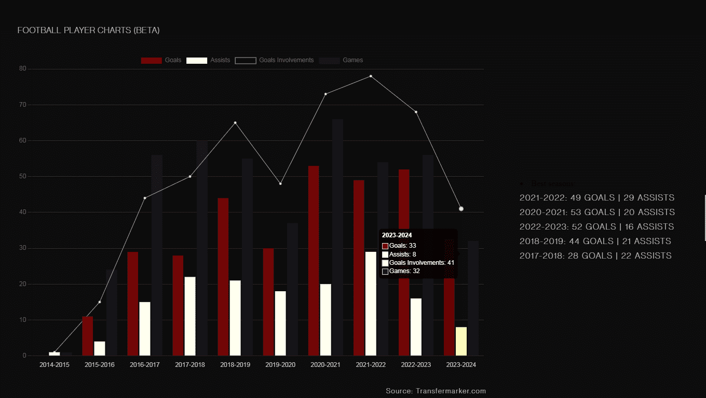

## Prueba de conocimiento con Django Rest Framework 

[Objetivo]<br>
Analizar el nivel de conocimiento de los postulantes a desarrollador de backend [Nombre de la empresa].<br> 
[Prueba lógica]<br>
Crear una API REST utilizando DJANGO REST FRAMEWORK, que brinde la siguiente funcionalidad básica y acotada de un Ecommerce.<br> 
El sistema debe tener los modelos Product, Order, OrderDetail con los siguientes atributos: 


#### Product: 
- id PK [string] 
- name [string] 
- price [float] 
- stock[int] 
#### Order:
- id PK
- date_time [datetime]

#### OrderDetail: 
- order [Order] 
- quantity [int] 
- product [Product] 


La misma debe proporcionar los siguientes end points: 

- Registrar/Editar un producto 
- Eliminar un producto 
- Consultar un producto 
- Listar todos los productos
- Modificar stock de un producto 
- Registrar/Editar una orden (inclusive sus detalles). Debe actualizar el stock del producto 
- Eliminar una orden. Restaura stock del producto 
- Consultar una orden y sus detalles 
- Listar todas las ordenes

La clase Order debe exponer un método get_total el cual calcula el total de la factura y retornar ese valor en el serializer correspondiente. También debe exponer el método get_total_usd, utilizando el API de https://www.dolarsi.com/api/api.php?type=valoresprincipales, con “dólar blue” para que te tire el precio en dolares. 

Al crear o editar una orden validar q haya suficiente stock del producto, en caso no contar con stock se debe retornar un error de validación. 

Para la implementación de la API se debe utilizar ModelViewSet, ModelSerializer. El código fuente de la api debe ser subido a un repositorio público, el cual debe ser proporcionado para su correcta examinación. A la hora de crear una orden se debe validar: 

- que la cantidad de cada producto sea mayor a 0 
- que no se repitan productos en el mismo pedido
- Implementar autenticación basada en tokens (JWT) 
- Deployar la api en producción, por ejemplo en heroku o https://www.pythonanywhere.com/, 
- Implementar test unitario para validar los endpoints.


# Ruins of Versailles | Ecommerce Project

API que proporciona la funcionalidad de un comercio electrónico sobre una tienda de pinturas.

### 💻 Tecnologias Usadas:

   
   

### Database del Proyecto:


### Serializers:
``` python
class OrderDetailSerializer(serializers.ModelSerializer):

    quantity = serializers.IntegerField(validators=[required,is_lower])

    class Meta:
        model  = OrderDetail       
        fields =  ('__all__')

    def validate(self, attrs):
        order    = attrs['order']
        product  = attrs['product']
        quantity = attrs['quantity'] 
        
        if OrderDetail.objects.filter(order=order,product=product).exists():
            data   = {'Error':'The product has already been requested in this order.'}
            raise serializers.ValidationError(data)

        get_prod  = Product.objects.get(name=product)     

        if get_prod.status == 'out-of-stock': 
            data   = {'Error':'This product is out-of-stock.'}
            raise serializers.ValidationError(data)     

        if get_prod.stock < quantity: 
            data   = {'Error':f'There is not enough stock left to add this product to the order. Stock available: {get_prod.stock}'}
            raise serializers.ValidationError(data) 

        return super().validate(attrs)
```
### ViewSets:
``` python
class OrderDetailView(ModelViewSet):

    serializer_class   = OrderDetailSerializer
    queryset           = OrderDetail.objects.all()

    def list(self, request):

        queryset   = OrderDetail.objects.all()
        serializer = OrderDetailSerializer(queryset, many=True)
        return Response(serializer.data)

    def create(self, validated_data):
        data = validated_data.data     

        serializer = self.get_serializer(data=data)

        if serializer.is_valid(raise_exception=True):
            action = OrderDetailActions(data['product'],data['order'],data['quantity']) 
            action.get_stock()  
            self.perform_create(serializer)

            # get total order 
            get_order   = Order.objects.get(id=data['order'])
            get_product = Product.objects.get(id=data['product'])

            get_order.total += (get_product.price * int(data['quantity']))
            get_order.save()

            # get total USD
            dolar  = get_exchange_rate()
            get_order.total_USD =  get_order.total / dolar

            get_order.save()
    
            return Response(serializer.data, status=status.HTTP_201_CREATED, ) 

    def destroy(self, request, *args, **kwargs):
        data = self.get_object()

        action = OrderDetailActions(data.product.id,data.order,data.cuantity) 
        action.return_stock()

        return super().destroy(request, *args, **kwargs)   
            
```
### Conexión a Dolarsi API   
``` python
def get_exchange_rate():
    url = 'https://www.dolarsi.com/api/api.php?type=valoresprincipales'
    response = requests.get(url)
    data = response.json()
    for item in data:
        if item['casa']['nombre'] == 'Dolar Blue':
            return float(item['casa']['venta'].replace(',', '.'))
``` 
### Conexión a Paypal (Vial Frontend)   
``` javascript
<!-- Include the PayPal JavaScript SDK -->
<script src="https://www.paypal.com/sdk/js?client-id=test&currency=USD"></script>

<script>
    // Render the PayPal button into #paypal-button-container
    paypal.Buttons({
        // Set up the transaction
        createOrder: function(data, actions) {
            return actions.order.create({
                purchase_units: [{
                    amount: {
                        value: String(document.querySelector(".total:nth-child(3) span:nth-child(2)").textContent).replace("$ ","")
                    }
                }]
            });
        },
        // Finalize the transaction
        onApprove: function(data, actions) {
            checkout()
        }
    }).render('#paypal-button-container');
</script>
``` 

### Resultado Final:


<br>

# Football Players Stats Api

El Football Players Stats API es un proyecto de Django Rest Framework diseñado para gestionar la información y las estadísticas de los jugadores de fútbol.

### 💻 Tecnologias Usadas:


 
  


 
 


### Arquitectura del Proyecto:


Como se puede ver, aqui estan los 3 modulos: 
- El webscraping que, una vez recolectado la informacion, se logea a la API principal y ya con el token obtenido envia la informacion.
- La api principal guarda o actualiza los datos en la base de datos. 
- Y la segunda api se encarga del analisis de datos.  

## API Endpoints
- ### Jugadores:
    - **GET /players/**: Get a list of players.
    - **GET /players/{id}/**: Get the player.
    - **POST /players/**: Create a new player. (Authentication required).
    - **PUT /players/{id}/**: Update a player. (Authentication required).
    - **DELETE /players/{id}**/: Delete a player. (Authentication required).

- ### Estadísticas de los Jugadores:
    - **GET /player_stats/**: Get a list of player statistics.
    - **GET /player_stats/{id}/**: Get the player statistics.
    - **POST /api/player_stats/**: Create new player statistics. (Authentication required).
    - **PUT /player_stats/{id}/**: Update player statistics. (Authentication required).
    - **DELETE /player_stats/{id}/**: Delete player statistics. (Authentication required).

- ### Estadísticas del jugador por posición  
    - **GET /player_stats_by_position/**: Get a list of player statistics by position.  

- ### Autenticación:
    - **POST /authentication/**: Get token authentication. 
    - **POST /register/**: Register a new user. 


### Función para obtener su token de autenticación

``` python
data = { "email": YOUR_EMAIL, "password": YOUR_PASSWORD}
```
``` python
def get_auth_token(data):     
    data_json = json.dumps(data) # convert data to JSON format    
    headers = {"Content-Type": "application/json"} # set headers to indicate JSON content    
    response = requests.post(API_AUTH_URL, data=data_json, headers=headers) # make a POST request to the authentication API
    
    if response.status_code == 200:  # check the response status code        
        token = response.json()['access'] # Extract and return the access token from the response
        return token
    else:        
        raise Exception(f"Error during request to stats API. Status code: {response.status_code}")        
```

### Web Scraping

Esta API utiliza un proceso automatizado llamado raspado web para recopilar datos. A continuación, almacena y actualiza esta información con regularidad para asegurarse de que sigue siendo precisa y actualizada.

Este proyecto de raspado web de Python se centra en extraer las estadísticas de los jugadores de fútbol del sitio web de Transfermarkt. El script principal, main.py, utiliza la biblioteca BeautifulSoup para analizar el contenido HTML de las páginas web y extraer la información necesaria. La programación para ejecutar este script se configura mediante GitHub Actions.

### Resultado Final:





<br><br><br>


# Django IAM System Project
### Descripción general
Este proyecto tiene como objetivo desarrollar un sistema integral de gestión de identidades y accesos (IAM) utilizando Django, que proporcione funciones sólidas de autenticación, autorización y seguridad de usuarios para una plataforma de gestión de tareas. El sistema IAM implementará tareas de forma asincrónica con Redis y Celery, trabajando con WebSockets para implementar chats en tiempo real, mejorando la comunicación entre los usuarios, resultando en una optimización general del proyecto.

### Database del Proyecto:


### Configuracion de settings/base.py
``` python
# iam_system_project/settings/base.py

DJANGO_APPS = [
    "daphne",
    ...
]
THIRD_PARTY_APPS = [
    'django_password_validators',
    'django_celery_results',
]
LOCAL_APPS = [
    'models', # This app is designed to store the models.
    'authentication',
    'task_management',
    'chat'
]

INSTALLED_APPS = DJANGO_APPS + THIRD_PARTY_APPS + LOCAL_APPS

...

# WSGI_APPLICATION = 'iam_system_project.wsgi.application'
ASGI_APPLICATION = 'iam_system_project.asgi.application'

CHANNEL_LAYERS = {
    'default': {
        'BACKEND': "channels.layers.InMemoryChannelLayer"
    }
}
```
### Configuración de asgi.py
``` python
# iam_system_project/asgi.py

import os
from chat.routing import websocket_urlpatterns
from channels.auth import AuthMiddlewareStack
from channels.routing import ProtocolTypeRouter, URLRouter
from channels.security.websocket import AllowedHostsOriginValidator
from django.core.asgi import get_asgi_application

os.environ.setdefault('DJANGO_SETTINGS_MODULE', 'iam_system_project.settings')

django_asgi_app = get_asgi_application()

application = ProtocolTypeRouter(
    {
        'http': django_asgi_app,
        'websocket': AllowedHostsOriginValidator(AuthMiddlewareStack(URLRouter(websocket_urlpatterns))),
    }
)
```
- El archivo consumer.py que maneja conexiones WebSocket y 
administra la comunicación entre el servidor y los clientes 

### Configuración de consumers.py

``` python
# chat/consumers.py

import json
from channels.generic.websocket import AsyncWebsocketConsumer
from .models import *
from .models import Message as Messages
from asgiref.sync import sync_to_async


User = get_user_model()

class ChatConsumer(AsyncWebsocketConsumer):
    async def connect(self):
        self.room_name = self.scope['url_route']['kwargs']['room_name']
        self.room_group_name = 'chat_%s' % self.room_name

        await self.channel_layer.group_add(
            self.room_group_name,
            self.channel_name
        )

        await self.accept()

        # Fetch messages for the room asynchronously
        messages_context = await self.get_messages_for_room(self.room_name)
        # Fetch messages asynchronously
        messages = await self.fetch_messages(messages_context)  

        # Send the serialized messages as JSON
        await self.send(text_data=json.dumps({
            'type': 'initial_messages',
            'messages': messages            
        }))   
                 

    async def disconnect(self, close_code):
        await self.channel_layer.group_discard(
            self.room_group_name,
            self.channel_name
        )

    async def receive(self, text_data):
        data_json = json.loads(text_data)
        message = data_json['message'].strip()  # Strip leading/trailing whitespace
        user = self.scope["user"]

        if message:  # Check if message is not empty
            await self.save_message(user, message)   

        await self.channel_layer.group_send(
            self.room_group_name,
            {
                'type': 'chat_message',
                'message': message,
                'username': user
            }
        )

    async def chat_message(self, event):       
        message = event['message']
        user = event['username']        
        sender = await self.get_sender_email(user.id)

        await self.send(text_data=json.dumps({
            'type': 'new_message',
            'message': message,
            'sender': sender 
        }))    
    
    @sync_to_async
    def get_messages_for_room(self,room_id):      
        thread = ChatRoom.objects.get(id=room_id)   
        messages = Messages.objects.filter(thread=thread).order_by("timestamp")
        return messages

    # Fetch messages asynchronously
    @sync_to_async
    def fetch_messages(self, messages_queryset):             
        serialized_messages = []
        for message in messages_queryset:  
            serialized_message = {
                'message': message.encrypted_content,
                'sender': message.sender.email,
                'timestamp' : message.timestamp.strftime('%Y-%m-%d %H:%M:%S %Z'),  
                'thread'   :  message.thread.id             
            }
            serialized_messages.append(serialized_message)
           
        return serialized_messages    
    

    @sync_to_async
    def save_message(self, user, message):
        thread = ChatRoom.objects.get(id=self.room_name)
        message_to_save = Messages(
            sender=user,
            encrypted_content=message,
            thread=thread
        )
        message_to_save.save()

    @sync_to_async
    def get_sender_email(self, user_id):
        try:
            sender = get_user_model().objects.get(id=user_id)
            return sender.email
        except User.DoesNotExist:
            return None
```

### Decoradores diseñados para restringir el acceso a una vista

```python

def user_has_role(allowed_roles):
    def decorator(view_func):
        @wraps(view_func)
        def _wrapped_view(request, *args, **kwargs):
            user_roles = UserRole.objects.filter(user=request.user)
            
            # Check if the user has any of the allowed roles
            if any(role.name in allowed_roles for user_role in user_roles for role in user_role.role.all()):
                return view_func(request, *args, **kwargs)
            else:
                return HttpResponseForbidden("You don't have permission to view this page.")
        
        return _wrapped_view

    return decorator

def is_authorized(user,role_selected):
    user_role = UserRole.objects.get(user=user)
    if any(role.name == role_selected for role in user_role.role.all()): 
        return True

```
- El decorador user_has_role  toma el argumento allowed_roles, que es una lista de roles 
permitidos para acceder a la vista decorada.
- El decorador interno que es el que realmente se aplica a la vista.
- Función envuelta _wrapped_view: Esta es la función que realmente realiza la lógica de 
verificación de roles y decide si permitir o no el acceso a la vista. Toma los mismos 
argumentos que la vista original
- Si el usuario tiene al menos uno de los roles permitidos, se ejecuta la vista original. 
De lo contrario, se devuelve un mensaje indicando que no tiene permiso.


### Ejemplo de tarea asincrona (Envio de email de recuperacion de contraseña)

```python
# authentication/tasks.py

from celery import shared_task
...

@shared_task(bind=True)
def send_async_email(self,subject, message, recipient_list):
    
    try:
        email = EmailMessage(subject, message, to=recipient_list, from_email=settings.EMAIL_HOST_USER )
        email.send()
        return True
    except Exception as e:
        # Log the exception or print it for debugging
        print(f"Error sending email: {e}")
        return False

# authentication/view.py

# Class for custom password reset view
class CustomPasswordResetView(PasswordResetView):
    form_class = CustomPasswordResetForm
    template_name = 'accounts/password_reset/password_reset.html'
    email_template_name = 'accounts/password_reset/password_reset_email.html'
    success_url = reverse_lazy('password_reset_done')

    @method_decorator(never_cache)
    @method_decorator(sensitive_post_parameters())
    @method_decorator(user_not_authenticated, name='dispatch')
    def dispatch(self, *args, **kwargs):
        return super().dispatch(*args, **kwargs)    

    def form_valid(self, form):
        user = get_user_model().objects.get(email=form.cleaned_data['email'])
        uidb64 = urlsafe_base64_encode(force_bytes(user.id))
        token = default_token_generator.make_token(user)
        reset_url = reverse_lazy('password_reset_confirm', kwargs={'uidb64': uidb64, 'token': token})

        subject = _('Password Reset on MY APP!')
        message = format_html(
            _("You're receiving this email because you requested a password reset for your user account at MY APP."
              "<br>Please click the following link to reset your password:<br><a href='{}' target='_blank' rel='noopener noreferrer'>Reset Password</a>"),
            reset_url
        )

        recipient_list = [form.cleaned_data['email']]

        send_async_email.delay(subject, message, recipient_list)
        # Redirect the user to the success URL
        return redirect(self.get_success_url())
```
